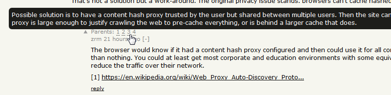
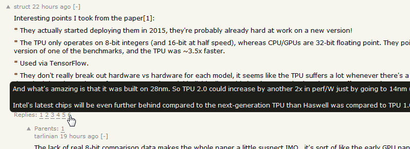

# Hacker News Plus

A web extension to enhance the Hacker News comment section.

## Features

This extension adds links to all parent comments for each comment.
You can hover over the links to see the content of those comments.

The parent links start with 1 (which is the highest parent in the comment thread) while the sequent numbers follow the thread up to the current comment.

Hoverable links are also added for all direct replies to a comment.

## Installation

Mozilla Firefox: [https://addons.mozilla.org/en-US/firefox/addon/hacker-news-plus/](https://addons.mozilla.org/en-US/firefox/addon/hacker-news-plus/)

Google Chrome: *TBA*

## License

MIT